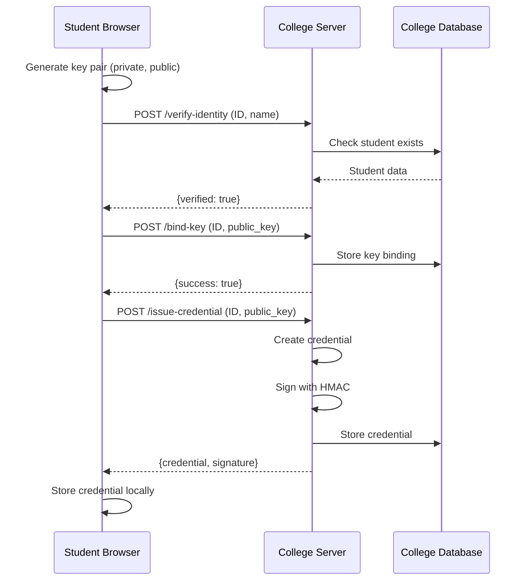
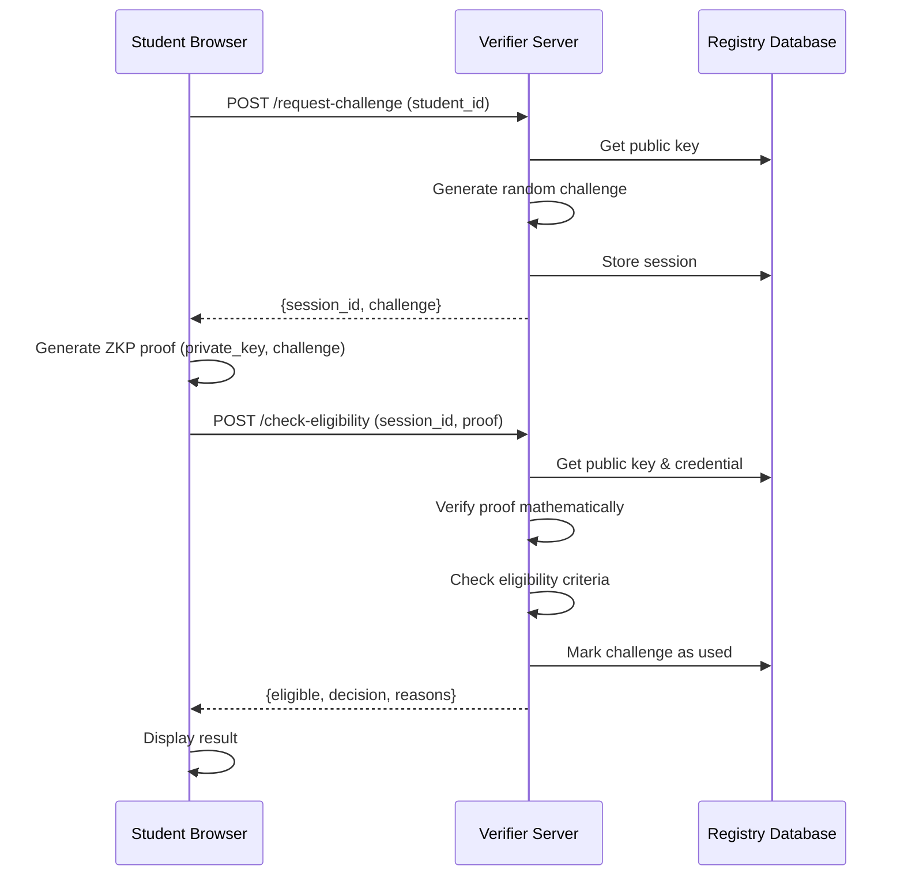

# ZKP Scholarship System - Complete Architecture Explanation

## 📁 Project Structure Overview

```
ZKP/
├── crypto/                    # Core cryptography module
│   ├── __init__.py           # Module initialization
│   ├── utils.py              # Cryptographic utilities
│   ├── keys.py               # Key generation and management
│   └── schnorr.py            # Zero-Knowledge Proof protocol
│
├── issuer/                    # College backend (Layer 2)
│   ├── __init__.py           # Module initialization
│   ├── database.py           # Student records database
│   ├── credentials.py        # Credential signing and validation
│   ├── app.py                # Flask API server
│   └── college.db            # SQLite database (created at runtime)
│
├── verifier/                  # Scholarship backend (Layer 3)
│   ├── __init__.py           # Module initialization
│   ├── registry.py           # Public key registry
│   ├── verification.py       # ZKP proof verification
│   ├── eligibility.py        # Scholarship eligibility logic
│   ├── app.py                # Flask API server
│   └── registry.db           # SQLite database (created at runtime)
│
├── student/                   # Frontend interfaces (Layer 1)
│   ├── home.html             # Landing page
│   ├── college_portal.html   # College credential interface
│   ├── scholarship_portal.html # Scholarship application interface
│   ├── index.html            # Original combined interface
│   ├── crypto.js             # Client-side cryptography
│   └── app.js                # Original application logic
│
├── tests/                     # Unit tests
│   └── test_schnorr.py       # Schnorr ZKP protocol tests
│
├── init_demo_data.py         # Initialize test student data
├── view_database.py          # Database inspection tool
├── start_system.ps1          # System startup script
├── requirements.txt          # Python dependencies
├── README.md                 # Main documentation
├── DEMO_GUIDE.md            # Demonstration guide
└── QUICK_START.md           # Quick reference guide
```

---

## 🔧 Core Cryptography Module (`crypto/`)

### 1. `crypto/__init__.py`
**Purpose**: Module initialization and exports

```python
# Exports the main classes for easy importing
from .utils import CryptoUtils
from .keys import KeyManager
from .schnorr import SchnorrZKP
```

**Role**: Allows other modules to import cryptographic functions easily.

---

### 2. `crypto/utils.py`
**Purpose**: Fundamental cryptographic utilities

**Key Components**:
- **Safe Prime**: 2048-bit prime number for cryptographic operations
- **Generator**: Base value for modular exponentiation
- **Random Number Generation**: Secure random values
- **Modular Arithmetic**: Efficient modular exponentiation

**How it works**:
```python
# Example: Generate random number in range
r = CryptoUtils.generate_random_in_range(q)

# Example: Modular exponentiation (g^r mod p)
result = CryptoUtils.mod_exp(g, r, p)
```

**Why it's needed**: Provides the mathematical foundation for all cryptographic operations.

---

### 3. `crypto/keys.py`
**Purpose**: Key pair generation and management

**How it works**:
1. Generate random private key (x)
2. Compute public key: y = g^x mod p
3. Serialize keys to/from JSON format
4. Store/retrieve keys from browser localStorage

**Key Functions**:
- `generate_key_pair()`: Creates new private/public key pair
- `serialize_keys()`: Converts keys to storable format
- `deserialize_keys()`: Loads keys from storage

**Example**:
```python
manager = KeyManager()
private_key, public_key = manager.generate_key_pair()
# private_key: secret number (never shared)
# public_key: g^private_key mod p (shared publicly)
```

---

### 4. `crypto/schnorr.py`
**Purpose**: Zero-Knowledge Proof protocol implementation

**The Schnorr Protocol** (Interactive):
1. **Commitment**: Prover generates random r, computes t = g^r mod p
2. **Challenge**: Verifier sends random challenge c
3. **Response**: Prover computes s = r + c*x mod q
4. **Verification**: Verifier checks if g^s = t * y^c mod p

**Why it's Zero-Knowledge**:
- Prover proves they know private key `x`
- WITHOUT revealing `x` itself
- Verifier learns nothing except "proof is valid"

**Key Functions**:
- `generate_commitment()`: Creates commitment (r, t)
- `generate_challenge()`: Creates random challenge
- `generate_response()`: Computes response s
- `verify_proof()`: Validates the proof

---

## 🏛️ Issuer Layer - College Backend (`issuer/`)

### 5. `issuer/database.py`
**Purpose**: Manage student records and credentials

**Database Schema**:
```sql
-- Student information
students (student_id, name, department, admission_year, gpa)

-- Public key bindings
key_bindings (student_id, public_key, bound_at)

-- Issued credentials
credentials (student_id, public_key, credential_data, signature, issued_at)
```

**Key Functions**:
- `get_student()`: Retrieve student information
- `bind_public_key()`: Link public key to student
- `store_credential()`: Save issued credential

**How it works**:
1. Stores student admission records
2. Binds student identity to their public key
3. Tracks all issued credentials

---

### 6. `issuer/credentials.py`
**Purpose**: Issue and validate digitally signed credentials

**Credential Structure**:
```json
{
  "student_id": "STU001",
  "name": "Alice Johnson",
  "department": "Computer Science",
  "admission_year": 2020,
  "gpa": 3.8,
  "public_key": "12345...",
  "issued_at": "2026-02-12T10:30:00"
}
```

**Digital Signature**:
- Uses HMAC-SHA256 with secret key
- Prevents tampering or forgery
- Verifiable by scholarship provider

**Key Functions**:
- `issue_credential()`: Create signed credential
- `validate_credential()`: Verify signature

**How it works**:
1. College creates credential with student data
2. Signs credential with secret key
3. Anyone can verify signature (but can't forge it)

---

### 7. `issuer/app.py`
**Purpose**: Flask API server for college operations

**API Endpoints**:

| Endpoint | Method | Purpose |
|----------|--------|---------|
| `/verify-identity` | POST | Verify student identity |
| `/bind-key` | POST | Bind public key to student |
| `/issue-credential` | POST | Issue signed credential |
| `/credential/<id>` | GET | Retrieve credential |
| `/add-student` | POST | Add new student (admin) |

**Example Flow**:
```
Student → POST /verify-identity (student_id, name)
       ← Response: {verified: true}

Student → POST /bind-key (student_id, public_key)
       ← Response: {success: true}

Student → POST /issue-credential (student_id, public_key)
       ← Response: {credential: {...}, signature: "..."}
```

**How it works**:
1. Receives requests from college portal
2. Validates student identity
3. Issues signed credentials
4. Runs on port 5001

---

## 🎯 Verifier Layer - Scholarship Backend (`verifier/`)

### 8. `verifier/registry.py`
**Purpose**: Maintain registry of certified public keys

**Database Schema**:
```sql
-- Certified public keys
certified_keys (student_id, public_key, credential_data, 
                signature, registered_at)

-- Verification sessions
verification_sessions (session_id, student_id, challenge, 
                       created_at, used)
```

**Key Functions**:
- `register_key()`: Add certified public key
- `get_public_key()`: Retrieve key for verification
- `create_challenge()`: Generate verification challenge
- `mark_challenge_used()`: Prevent replay attacks

**How it works**:
1. Stores public keys verified by college
2. Generates fresh challenges for each verification
3. Tracks which challenges have been used

---

### 9. `verifier/verification.py`
**Purpose**: Verify Zero-Knowledge Proofs

**Verification Process**:
```python
# Proof contains: t (commitment), s (response), c (challenge)
# Public key: y

# Verify: g^s = t * y^c mod p
left = g^s mod p
right = (t * y^c) mod p
valid = (left == right)
```

**Key Functions**:
- `verify_complete_proof()`: Validate entire proof
- `verify_proof()`: Check mathematical correctness

**How it works**:
1. Receives proof from student
2. Uses public key from registry
3. Verifies proof mathematically
4. Returns true/false (no information leaked!)

---

### 10. `verifier/eligibility.py`
**Purpose**: Determine scholarship eligibility

**Eligibility Criteria**:
- GPA ≥ 3.5
- Admitted before 2022
- Valid credential signature
- Valid ZKP proof

**Decision Logic**:
```python
if proof_valid and gpa >= 3.5 and admission_year < 2022:
    return "GRANT"
else:
    return "DENY"
```

**Key Functions**:
- `check_eligibility()`: Make eligibility decision
- `evaluate_criteria()`: Check individual criteria

**How it works**:
1. Validates credential signature
2. Checks eligibility criteria
3. Returns decision with reasons
4. **Never sees student's name!**

---

### 11. `verifier/app.py`
**Purpose**: Flask API server for scholarship operations

**API Endpoints**:

| Endpoint | Method | Purpose |
|----------|--------|---------|
| `/register-credential` | POST | Register certified credential |
| `/request-challenge` | POST | Get verification challenge |
| `/verify-proof` | POST | Verify ZKP proof |
| `/check-eligibility` | POST | Check scholarship eligibility |
| `/registry/<id>` | GET | Get registered key info |

**Complete Verification Flow**:
```
Student → POST /request-challenge (student_id)
       ← Response: {session_id, challenge}

Student → [Generates ZKP proof locally]

Student → POST /check-eligibility (session_id, student_id, proof)
       ← Response: {eligible: true, decision: "GRANT", reasons: [...]}
```

**How it works**:
1. Receives credential registrations from college
2. Issues challenges for verification
3. Verifies ZKP proofs
4. Makes eligibility decisions
5. Runs on port 5002

---

## 🖥️ Student Frontend (`student/`)

### 12. `student/home.html`
**Purpose**: Landing page with system overview

**Features**:
- Links to both portals
- System explanation
- Demo instructions
- Visual design with gradients

**How it works**:
- Simple HTML page
- Opens college_portal.html or scholarship_portal.html in new tabs

---

### 13. `student/college_portal.html`
**Purpose**: Interface for obtaining credentials from college

**User Workflow**:
1. **Generate Keys** → Creates private/public key pair
2. **Request Credential** → Sends identity + public key to college
3. **Receive Credential** → Gets signed credential
4. **Navigate to Scholarship** → Link to scholarship portal

**Key Features**:
- Client-side key generation
- Identity verification
- Credential issuance
- Privacy notes explaining the process

**How it works**:
1. Uses `crypto.js` for key generation
2. Calls issuer API endpoints
3. Stores keys in localStorage
4. Displays success/error messages

---

### 14. `student/scholarship_portal.html`
**Purpose**: Interface for anonymous scholarship applications

**User Workflow**:
1. **Enter Student ID** → Only for key lookup
2. **Generate ZKP Proof** → Proves knowledge of private key
3. **Submit Application** → Sends proof to verifier
4. **Receive Decision** → Gets eligibility result

**Privacy Features**:
- Explains what verifier can/cannot see
- Shows unauthorized access testing
- Emphasizes zero-knowledge property

**How it works**:
1. Retrieves keys from localStorage
2. Requests challenge from verifier
3. Generates ZKP proof using `crypto.js`
4. Submits proof and displays result

---

### 15. `student/crypto.js`
**Purpose**: Client-side cryptography implementation

**Key Functions**:

```javascript
// Generate key pair
function generateKeyPair() {
    const privateKey = randomBigInt(q);
    const publicKey = modPow(g, privateKey, p);
    return {privateKey, publicKey};
}

// Create ZKP proof
function createProof(privateKey, challenge) {
    const r = randomBigInt(q);           // Random nonce
    const t = modPow(g, r, p);           // Commitment
    const c = BigInt(challenge);         // Challenge
    const s = (r + c * privateKey) % q;  // Response
    return {t, s, c};
}

// Store/retrieve keys
function storeKeys(privateKey, publicKey) { ... }
function retrieveKeys() { ... }
```

**How it works**:
1. Implements Schnorr ZKP in JavaScript
2. Uses BigInt for large number arithmetic
3. Stores keys in browser localStorage
4. Never transmits private key!

---

### 16. `student/app.js`
**Purpose**: Original combined application logic

**Note**: This is the old single-page interface. The new system uses separate portals (college_portal.html and scholarship_portal.html) for better privacy demonstration.

---

## 🧪 Testing & Utilities

### 17. `tests/test_schnorr.py`
**Purpose**: Unit tests for Schnorr ZKP protocol

**Test Coverage**:
- Key generation correctness
- Proof creation and verification
- Completeness (valid proofs accepted)
- Soundness (invalid proofs rejected)
- Zero-knowledge property
- Edge cases (invalid inputs)

**How to run**:
```bash
python -m pytest tests/test_schnorr.py -v
```

---

### 18. `init_demo_data.py`
**Purpose**: Initialize test student data

**What it does**:
1. Creates 5 test students (STU001-STU005)
2. Populates college database
3. Provides ready-to-use test data

**How to run**:
```bash
python init_demo_data.py
```

---

### 19. `view_database.py`
**Purpose**: Inspect database contents

**Features**:
- Shows all students
- Shows key bindings
- Shows credentials
- Shows verification sessions

**How to run**:
```bash
python view_database.py
```

---

### 20. `start_system.ps1`
**Purpose**: Launch all system components

**What it does**:
1. Starts issuer server (port 5001)
2. Starts verifier server (port 5002)
3. Opens home page in browser

**How to run**:
```powershell
.\start_system.ps1
```

---

## 🔄 Complete System Flow

### Phase 1: Credential Issuance (College Portal)



### Phase 2: Anonymous Verification (Scholarship Portal)



---

## 🔐 Privacy & Security Features

### What Each Party Knows

| Party | Has Access To | Does NOT Have |
|-------|---------------|---------------|
| **Student** | Private key, All data | N/A |
| **College** | Name, ID, Public key | Scholarship applications, Private key |
| **Scholarship** | Public key, Credential data, Proof | Name, ID, Private key |

### Security Mechanisms

1. **Digital Signatures** (HMAC-SHA256)
   - Prevents credential forgery
   - Verifiable by anyone with public key

2. **Zero-Knowledge Proofs** (Schnorr Protocol)
   - Proves key ownership without revealing key
   - Mathematically sound and complete

3. **Challenge-Response**
   - Fresh challenge each time
   - Prevents replay attacks

4. **Session Management**
   - One-time use challenges
   - Prevents reuse of old proofs

---

## 🎯 Key Takeaways

1. **Separation of Concerns**: College and scholarship systems are independent
2. **Privacy by Design**: Personal info never leaves college system
3. **Cryptographic Security**: Based on proven mathematical protocols
4. **Practical Implementation**: Real-world applicable architecture

The system demonstrates how Zero-Knowledge Proofs enable privacy-preserving verification in real-world scenarios!
